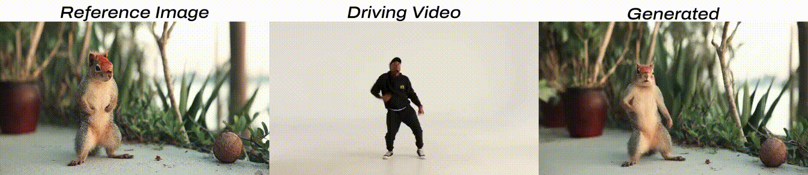
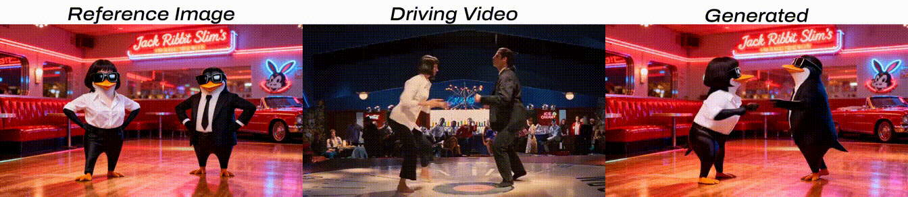

 <h1>: Towards Studio-Grade Character Animation via In-Context Learning of 3D-Consistent Pose Representations</h1>


 <div align="center">
  <a href='https://arxiv.org/abs/2512.05905'></a>
  <a href='https://huggingface.co/zai-org/SCAIL-Preview/tree/main'></a>
  <a href='https://modelscope.cn/models/ZhipuAI/SCAIL-Preview'></a>
  <a href='https://teal024.github.io/SCAIL/'></a>
</div>


This repository contains the official implementation code for **SCAIL (Studio-Grade Character Animation via In-Context Learning)**, a framework that enables high-fidelity character animation under diverse and challenging conditions, including large motion variations, stylized characters, and multi-character interactions.


<p align="center">
  
</p>

## 🔎 Motivation and Results
SCAIL identifies the key bottlenecks that hinder character animation towards production level: limited generalization towards characters and incoherent motion under complex scenarios (e.g., the long-standing challenge of multi-character interactions, as well as common failures in basic motions like flipping and turning). We revisit the core components of character animation -- how to represent the pose representation and how to inject the pose. Our framework resolves the challenge that pose representations cannot simultaneously prevent identity leakage and preserve rich motion information, and compels the model to perform spatiotemporal reasoning over the entire motion sequence for more natural and coherent movements. Check our methods, results gallery, as well as comparisons against other baselines at our [project page](https://teal024.github.io/SCAIL/).

<p align="center">
  
  
  
</p>

## 🗞️ Update and News
* 2025.12.08: 🔥 We release the inference code of SCAIL on [SAT](https://github.com/THUDM/SwissArmyTransformer).
* 2025.12.11: 👀 We’ve added more interesting cases to our gallery on [project page](https://teal024.github.io/SCAIL/)! Check it out! 
* 2025.12.11: 💥 SCAIL is now officially opensourced on [HuggingFace](https://huggingface.co/zai-org/SCAIL-Preview) and [ModelScope](https://modelscope.cn/models/ZhipuAI/SCAIL-Preview)!!


## 📋 TODOs
- [x] **SCAIL-14B-Preview Model Weights**(512p, 5s) and Inference Config
- [ ] Prompt Optimization Snippets
- [ ] New Branch for **Implementation on Wan Official Framework** and **ComfyUI Support**
- [ ] **SCAIL-Official(1.3B/14B) Model Weights**(Improved Stability and Clarity, Long Video Generation Capability) and Inference Config

## 🚀 Getting Started
### Checkpoints Download

<!-- **Note:** Due to double-blind review requirements, we do not provide the checkpoint download link here.  -->

| ckpts       | Download Link                                                                                                                                           |    Notes                      |
|--------------|---------------------------------------------------------------------------------------------------------------------------------------------------------|-------------------------------|
| SCAIL-Preview(14B) | [🤗 Hugging Face](https://huggingface.co/zai-org/SCAIL-Preview)<br> [🤖 ModelScope](https://modelscope.cn/models/ZhipuAI/SCAIL-Preview)     | Supports  512P

Use the following commands to download the model weights
(We have integrated both Wan VAE and T5 modules into this checkpoint for convenience).

```bash
# Download the repository (skip automatic LFS file downloads)
GIT_LFS_SKIP_SMUDGE=1 git clone https://huggingface.co/zai-org/SCAIL-Preview
```
The files should be organized like:
```
SCAIL-Preview/
├── Wan2.1_VAE.pth
├── model
│   ├── 1
│   │   └── mp_rank_00_model_states.pt
│   └── latest
└── umt5-xxl
    ├── ...
```


### Environment Setup
Please make sure your Python version is between 3.10 and 3.12, inclusive of both 3.10 and 3.12.
```
pip install -r requirements.txt
```

## 🦾 Usage
### Input preparation
The input data should be organized as follows, we have provided some example data in `examples/`:
```
examples/
├── 001
│   ├── driving.mp4
│   ├── ref.jpg
└── 002
    ├── driving.mp4
    └── ref.jpg
...
```
### Pose Extraction & Rendering
We provide our pose extraction and rendering code in another repo [SCAIL-Pose](https://github.com/teal024/SCAIL-Pose), which can be used to extract the pose from the driving video and render them. We recommand using another environment for pose extraction due to dependency issues. Clone that repo to `SCAIL-Pose` folder and follow instructions in it.
After pose extraction and rendering, the input data should be organized as follows:
```
examples/
├── 001
│   ├── driving.mp4
│   ├── ref.jpg
│   └── rendered.mp4 (or rendered_aligned.mp4)
└── 002
...
```

### Model Inference
Run the following command to start the inference:
```
bash scripts/sample_sgl_1Bsc_xc_cli.sh
```

The CLI will ask you to input in format like `<prompt>@@<example_dir>`, e.g. `the girl is dancing@@examples/001`. The `example_dir` should contain rendered.mp4 or rendered_aligned.mp4 after pose extraction and rendering. Results will be save to `samples/`.

Note that our model is trained with **long detailed prompts**, even though a short or even null prompt can be used, the result may not be as good as the long prompt. We will provide our prompt generation snippets, using Google [Gemini](https://deepmind.google/models/gemini/) to read from the reference image and the driving motion and generate a detailed prompt like `A woman with curly hair is joyfully dancing along a rocky shoreline, wearing a sleek blue two-piece outfit. She performs various dance moves, including twirling, raising her hands, and embracing the lively seaside atmosphere, her tattoos and confident demeanor adding to her dynamic presence.` 

You can further choose sampling configurations like resolution in the yaml file under `configs/sampling/` or directly modify `sample_video.py` for customized sampling logic.

## ✨ Acknowledgements
Our implementation is built upon the foundation of [Wan 2.1](https://github.com/Wan-Video/Wan2.1) and the overall project architecture is built using [SAT](https://github.com/THUDM/SwissArmyTransformer). We utilized [NLFPose](https://github.com/isarandi/nlf) for reliable pose extraction. Thanks for their remarkable contribution and released code.

## 📄 Citation

If you find this work useful in your research, please cite:

```bibtex
@article{yan2025scail,
  title={SCAIL: Towards Studio-Grade Character Animation via In-Context Learning of 3D-Consistent Pose Representations},
  author={Yan, Wenhao and Ye, Sheng and Yang, Zhuoyi and Teng, Jiayan and Dong, ZhenHui and Wen, Kairui and Gu, Xiaotao and Liu, Yong-Jin and Tang, Jie},
  journal={arXiv preprint arXiv:2512.05905},
  year={2025}
}
```
